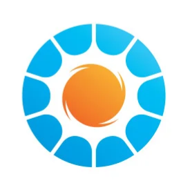

# Jepirachi - Plataforma de Enseñanza



[](https://www.typescriptlang.org/)
[](https://reactjs.org/)
[](https://mui.com/)
[](https://opensource.org/licenses/MIT)

Jepirachi (que significa *"enseñanza"* en Wayuú) es una plataforma educativa enfocada en la capacitación para el mantenimiento de paneles solares, especialmente diseñada para comunidades con acceso limitado a internet en regiones como La Guajira, Colombia.

## 🚀 Características principales

- ✅ **Contenido offline**: Acceso a materiales educativos sin conexión continua a internet
- 📚 **Módulos interactivos**: Lecciones paso a paso con videos demostrativos
- 🧪 **Evaluaciones prácticas**: Seguimiento del progreso con evaluaciones integradas
- 🌐 **Soporte multilingüe**: Español, Inglés y Wayuú
- 📱 **Diseño responsivo**: Adaptable a diferentes dispositivos y tamaños de pantalla

## Arquitectura Técnica

### Visión general

La aplicación está construida con una arquitectura frontend moderna basada en React. Utiliza un diseño orientado a componentes con manejo de estado centralizado a través de Context API de React, lo que permite una gestión eficiente del estado de la aplicación sin necesidad de bibliotecas externas más pesadas como Redux.

### Estructura del proyecto

```
src/
├── assets/             # Recursos estáticos (imágenes, iconos)
├── components/         # Componentes reutilizables de UI
├── context/            # Contextos de React para estado global
├── interface/          # Definiciones de tipos e interfaces
├── layouts/            # Componentes estructurales del diseño
├── pages/              # Componentes de páginas completas
├── routes/             # Configuración de enrutamiento
├── theme/              # Configuración del tema de diseño
├── utils/              # Funciones y utilidades auxiliares
└── __tests__/          # Tests e2e e integración
```

## Tecnologías utilizadas

### Principales

- **React 19**: Biblioteca principal para la construcción de interfaces
- **TypeScript 4.9**: Tipado estático para mejorar la calidad del código
- **React Router 7**: Navegación y enrutamiento entre páginas
- **Material UI 7**: Sistema de diseño de componentes
- **React YouTube**: Integración con la API de YouTube para visualización de videos educativos
- **DayJS**: Biblioteca ligera para manejo de fechas y soporte para localización

### Testing

- **Jest**: Framework de testing
- **React Testing Library**: Utilidades para testing de componentes React
- **Testing Library User Event**: Simulación de eventos de usuario para pruebas
- **Jest DOM**: Extensiones de Jest para testing en DOM

## Detalles de implementación

### Internacionalización

El sistema soporta múltiples idiomas (Español, Inglés y Wayuú) a través de un `LanguageContext` personalizado que utiliza un sistema de traducciones basado en objetos JSON. Cada componente puede acceder a las traducciones mediante el hook `useLanguage`.

### Autenticación y Autorización

La gestión de sesiones de usuario se maneja a través de `AuthContext`, que proporciona funciones para login, registro y logout, además de mantener el estado de autenticación. Para esta versión inicial, la autenticación se simula con datos almacenados en localStorage.

### Visualización de contenido educativo

Los módulos educativos se presentan con un sistema progresivo que permite:
- Reproducción de videos tutoriales
- Seguimiento del progreso del estudiante
- Evaluaciones interactivas
- Generación de certificados al completar el curso

### Modo offline

La aplicación está diseñada considerando la posibilidad de uso en áreas con conectividad limitada, implementando:
- Almacenamiento local del progreso del usuario
- Carga eficiente de recursos multimedia
- UI optimizada para funcionar con conexiones inestables


## Contribución al proyecto

### Estándares de código

- Se utiliza ESLint con la configuración extendida de React para mantener la consistencia del código.
- Los componentes deben tener pruebas unitarias asociadas.
- Se prefiere el uso de componentes funcionales con hooks en lugar de componentes de clase.

### Proceso de testing

1. **Pruebas unitarias**: Para componentes individuales usando React Testing Library
2. **Pruebas de integración**: Para flujos completos como autenticación
3. **Pruebas end-to-end**: Para simular interacciones reales de usuario

Para ejecutar las pruebas:
```bash
npm test
```

### Añadiendo nuevos idiomas

Para añadir un nuevo idioma al sistema:

1. Extender el objeto de traducciones en `LanguageContext.tsx`
2. Crear un nuevo locale para DayJS si es necesario
3. Actualizar el selector de idiomas en los componentes relevantes

## Requisitos del sistema

- Node.js 18.0 o superior
- npm 8.0 o superior
- Navegadores modernos (Chrome 90+, Firefox 90+, Edge 90+, Safari 14+)

## Instalación y configuración

1. Clona el repositorio:
   ```bash
   git clone https://github.com/tu-usuario/jepirachi-platform.git
   cd jepirachi-platform
   ```

2. Instala las dependencias:
   ```bash
   npm install
   ```

3. Configura las variables de entorno (opcional):
   Crea un archivo `.env.local` en la raíz del proyecto y define las variables necesarias.

## Inicializar Jepirachi

Desde el directorio principal, ejecuta:
```bash
npm start
```

La aplicación se ejecutará en el navegador en [http://localhost:3000](http://localhost:3000)

## Comandos disponibles

| Comando | Descripción |
|---------|-------------|
| `npm start` | Inicia la aplicación en modo desarrollo |
| `npm test` | Ejecuta las pruebas con cobertura |
| `npm run build` | Genera una versión de producción en la carpeta `/build` |

## Despliegue

La aplicación está preparada para ser desplegada en servicios como:

- Netlify
- Vercel
- GitHub Pages
- Firebase Hosting

Para el despliegue en producción, ejecuta:
```bash
npm run build
```

Y luego sube los archivos de la carpeta `/build` a tu servidor preferido.

## Licencia

Este proyecto está licenciado bajo MIT License - consulta el archivo LICENSE para más detalles.

## Equipo

Desarrollado como parte del Proyecto Integrador II en la Universidad de La Salle, enfocado en soluciones tecnológicas para comunidades rurales con acceso limitado a recursos educativos.

## Estado del proyecto

El proyecto se encuentra actualmente en fase beta (Mayo 2025). Se están implementando nuevas características y mejorando la estabilidad.

## Documentación adicional

Para obtener información más detallada sobre el uso y desarrollo de la plataforma, consulta los siguientes recursos:

- 📘 [Manual de Usuario](./docs/user-manual/technicalInfo.md) - Instrucciones paso a paso para utilizar la plataforma
- 🧰 [Documentación Técnica](./docs/code-docs/userManual.md) - Detalles sobre la implementación y código fuente